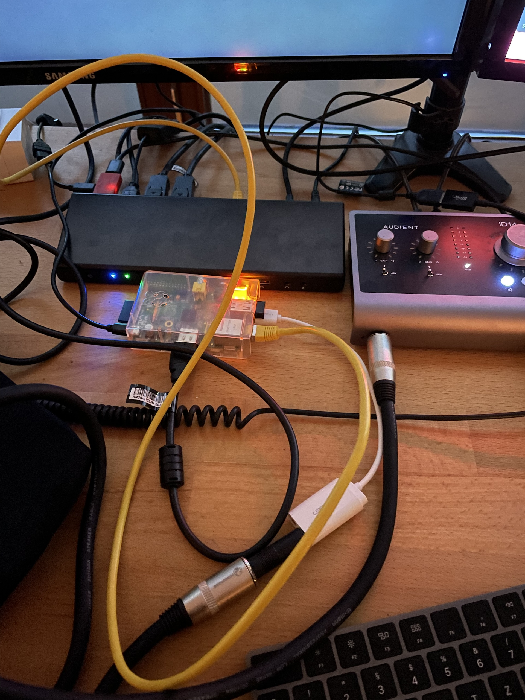

# Raspi

My collection of Raspberry Pi stuff.

## Prerequisites

Install [ansible](https://docs.ansible.com/ansible/latest/installation_guide/intro_installation.html) and [Rasperry Pi Imager](https://www.raspberrypi.com/software/).

Create a ansible hosts file like:

```conf
[local]
__host__

[all:vars]
ansible_connection=ssh
ansible_user=__user__
ansible_ssh_pass=__password__
```

## Playbooks

### Audiobox

`ansible-playbook ansible/audiobox.yml`

Tested with a `Raspberry Pi OS Lite (32-bit)` on a __Pi B+__ with an __Edimax EW-7611ULB 2- in 1 Wireless & Bluetooth nano USB Adapter__ and a __UGREEN USB Stereo Audio Adapter__.



